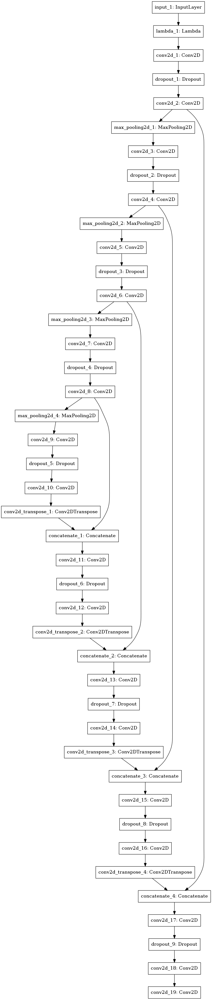

# DATA-SCIENCE-BOWL-2018
## Find the nuclei in divergent images to advance medical discovery
### Spot Nuclei. Speed Cures.
  Imagine speeding up research for almost every disease, from lung cancer and heart disease to rare disorders. The 2018 Data Science Bowl   offers our most ambitious mission yet: create an algorithm to automate nucleus detection.

  We’ve all seen people suffer from diseases like cancer, heart disease, chronic obstructive pulmonary disease, Alzheimer’s, and diabetes.   Many have seen their loved ones pass away. Think how many lives would be transformed if cures came faster.

  By automating nucleus detection, you could help unlock cures faster—from rare disorders to the common cold. 
  
# Deep Learning Tutorial for Kaggle Find the nuclei in divergent images to advance medical discovery competition, using Keras

This tutorial shows how to use [Keras library](http://keras.io/) to build deep neural network for Find the nuclei in divergent images to advance medical discovery
More info on this Kaggle competition can be found on [https://www.kaggle.com/c/data-science-bowl-2018](https://www.kaggle.com/c/data-science-bowl-2018).

This deep neural network achieves **~0.302 score on the leaderboard** based on test images,
and can be a good staring point for further, more serious approaches.

The architecture was inspired by [U-Net: Convolutional Networks for Biomedical Image Segmentation](http://lmb.informatik.uni-freiburg.de/people/ronneber/u-net/).

## Overview

### Data
```bash
  cd data
  mkdir stage1_train stage1_test
  unzip stage1_train.zip -d stage1_train/
  unzip stage1_test.zip -d stage1_test/
```
Data for the competition is available in the data folder.```data_util.py``` just loads the images and saves them into NumPy binary format files **.npy** for faster loading later.

### Pre-processing
The images are not pre-processed in any way,except resizing 256 x 256

### Run the model
```bash
  python main.py
```
It will train,predict and generate submission file

### Run the Data-science-bowl-2018 notebook on Google colab
0) Download the Data-science-bowl-2018.ipynb notebook from this repo
1) Goto [Colab](https://colab.research.google.com)
2) Goto File-->Upload Notebook . Upload the notebook
3) Goto menu Runtime-->Change runtime and select HardWare accelerator GPU (Free Nvidia K80 GPU from google,it can run continues for 12hrs)
4) Execute all cells and download the submission files from colab (Codes included at end of Notebook for downloading files to local system from colab)

To learn more about colab [Click Here](https://medium.com/deep-learning-turkey/google-colab-free-gpu-tutorial-e113627b9f5d)

### Training
 The model is trained for 150 epochs,where each epoch took 8sec on NVIDIA K80 GPU
 
 loss function used keras binary_cross_entropy
 
 The weights are updated by Adam optimizer, with a 1e-5 learning rate.

### Dependencies
* skimage
* Tensorflow
* Keras >= 2.1.2
* Pandas
 
 Python version 3

### Model
 The provided model is basically a convolutional auto-encoder, but with a twist - it has skip connections from encoder layers to decoder layers that are on the same "level".
See picture below (note that image size and numbers of convolutional filters in this tutorial differs from the original U-Net architecture).


This deep neural network is implemented with Keras functional API, which makes it extremely easy to experiment with different interesting architectures.

Output from the network is a 128 x 128 which represents mask that should be learned. Sigmoid activation function
makes sure that mask pixels are in \[0, 1\] range.

### Model Constructed using KERAS API



